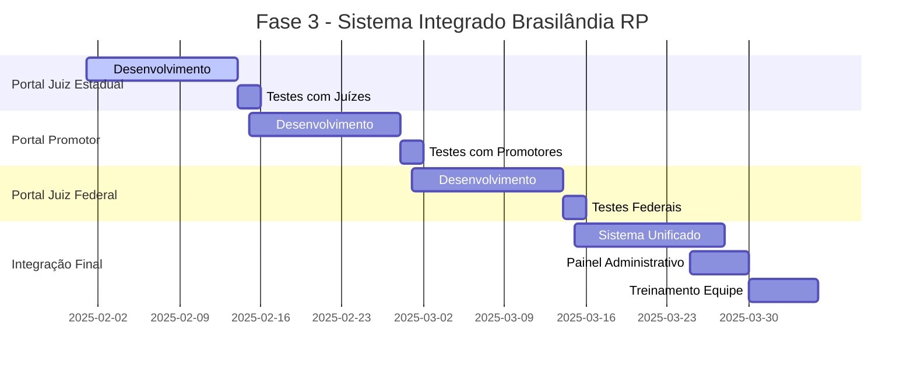

# 🎮 FASE 3 - PLANO DETALHADO BRASILÂNDIA RP

## 🏙️ CONTEXTO FINAL

**Portal Jurídico de Brasilândia** - Sistema para cidade de **GTA RP** com **máximo 20-30 usuários** incluindo advogados, juízes e promotores novatos no RP jurídico.

---

## 🎯 OBJETIVOS FASE 3 (2 MESES)

### **🔗 1. INTEGRAÇÃO TOTAL DOS PORTAIS**
- Portal do Juiz Estadual
- Portal do Juiz Federal  
- Portal do Promotor
- Dashboard administrativo unificado

### **🎮 2. SIMPLIFICAÇÃO PARA RP**
- Biblioteca de leis de Brasilândia
- Templates específicos para crimes RP
- Sistema de evidências (screenshots/vídeos)
- Guias para novatos no RP jurídico

### **👨‍💼 3. GESTÃO CENTRALIZADA**
- Painel do líder jurídico
- Controle de usuários (20-30 pessoas)
- Relatórios de atividade
- Sistema de permissões

---

## 🏗️ ROADMAP DETALHADO

### **🗓️ SEMANA 1-2: PORTAL DO JUIZ ESTADUAL**

#### **📋 Funcionalidades Principais:**
```javascript
const JuizEstadual = {
  cases: {
    received: 'Processos recebidos dos advogados',
    inProgress: 'Casos em julgamento',
    completed: 'Sentenças proferidas'
  },
  
  hearings: {
    schedule: 'Agendar audiências',
    conduct: 'Conduzir sessões RP',
    record: 'Gravar decisões'
  },
  
  sentences: {
    templates: 'Modelos de sentença para crimes RP',
    generator: 'Geração automática baseada no caso',
    signature: 'Assinatura digital do juiz'
  }
};
```

#### **⚖️ Templates de Sentença:**
```javascript
const SentencasRP = {
  criminal: {
    roubo: {
      template: 'Sentença Criminal - Roubo',
      penaBase: '4-10 anos',
      multaBase: '50k-300k',
      agravantes: ['Arma de fogo', 'Reincidência', 'Concurso'],
      atenuantes: ['Confissão', 'Reparação do dano']
    },
    
    homicidio: {
      template: 'Sentença Criminal - Homicídio', 
      penaBase: '6-20 anos',
      multaBase: '100k-500k',
      qualificadoras: ['Motivo fútil', 'Meio cruel', 'Recurso que dificultou defesa']
    }
  },
  
  civil: {
    danos: 'Indenização por danos morais/materiais',
    divorcio: 'Dissolução de casamento RP',
    inventario: 'Partilha de bens RP'
  }
};
```

#### **📊 Dashboard do Juiz:**
```html
<!-- Painel do Juiz Estadual -->
<section id="dashboard-juiz">
  <div class="grid grid-cols-1 md:grid-cols-3 gap-6">
    <!-- Processos Pendentes -->
    <div class="bg-card p-6 rounded-lg">
      <h3>📋 Processos Pendentes</h3>
      <div class="text-3xl font-bold text-blue-400" id="processos-pendentes">12</div>
      <p class="text-sm text-gray-400">Aguardando julgamento</p>
    </div>
    
    <!-- Audiências Hoje -->
    <div class="bg-card p-6 rounded-lg">
      <h3>⚖️ Audiências Hoje</h3>
      <div class="text-3xl font-bold text-green-400" id="audiencias-hoje">3</div>
      <p class="text-sm text-gray-400">Sessões de RP agendadas</p>
    </div>
    
    <!-- Sentenças Proferidas -->
    <div class="bg-card p-6 rounded-lg">
      <h3>📄 Sentenças (Mês)</h3>
      <div class="text-3xl font-bold text-purple-400" id="sentencas-mes">8</div>
      <p class="text-sm text-gray-400">Casos julgados</p>
    </div>
  </div>
  
  <!-- Fila de Processos -->
  <div class="bg-card p-6 rounded-lg mt-6">
    <h3>📋 Fila de Julgamento</h3>
    <div id="fila-processos">
      <!-- Lista de processos será carregada aqui -->
    </div>
  </div>
</section>
```

---

### **🗓️ SEMANA 3-4: PORTAL DO PROMOTOR**

#### **🔍 Funcionalidades Principais:**
```javascript
const Promotor = {
  investigations: {
    newCase: 'Instaurar inquérito',
    evidence: 'Coletar evidências RP',
    witnesses: 'Ouvir testemunhas'
  },
  
  prosecutions: {
    charges: 'Denunciar réus',
    plea: 'Negociar acordos',
    appeal: 'Recurso em casos perdidos'
  },
  
  criminalStats: {
    monthly: 'Estatísticas mensais de criminalidade',
    trends: 'Tendências de crimes no servidor',
    reports: 'Relatórios para governo RP'
  }
};
```

#### **📊 Crimes Mais Comuns (Brasilândia):**
```javascript
const CrimesComuns = {
  patrimonio: {
    roubo: { frequencia: '35%', areas: ['Centro', 'Periferia'] },
    furto: { frequencia: '20%', areas: ['Comércio', 'Residencial'] },
    receptacao: { frequencia: '10%', areas: ['Ferros-velhos', 'Oficinas'] }
  },
  
  drogas: {
    trafico: { frequencia: '15%', areas: ['Favelas', 'Pontos'] },
    porte: { frequencia: '8%', areas: ['Ruas', 'Festas'] }
  },
  
  violentos: {
    homicidio: { frequencia: '5%', areas: ['Gangues', 'Acerto de contas'] },
    lesao: { frequencia: '7%', areas: ['Brigas', 'Domestica'] }
  }
};
```

#### **🎯 Sistema de Investigação RP:**
```html
<!-- Investigação Criminal -->
<section id="nova-investigacao">
  <form class="space-y-6">
    <div class="grid md:grid-cols-2 gap-4">
      <div>
        <label>🔍 Tipo de Crime</label>
        <select id="tipo-crime" class="w-full p-3 rounded bg-gray-800">
          <option value="roubo">Roubo</option>
          <option value="homicidio">Homicídio</option>
          <option value="trafico">Tráfico</option>
          <option value="furto">Furto</option>
        </select>
      </div>
      
      <div>
        <label>📍 Local do Crime</label>
        <input type="text" id="local-crime" 
               placeholder="Ex: Banco Central, Rua Principal..."
               class="w-full p-3 rounded bg-gray-800">
      </div>
    </div>
    
    <div>
      <label>📝 Descrição dos Fatos</label>
      <textarea id="descricao-fatos" rows="4" 
                placeholder="Descreva o que aconteceu no RP..."
                class="w-full p-3 rounded bg-gray-800"></textarea>
    </div>
    
    <div>
      <label>🎮 Evidências (Screenshots/Vídeos)</label>
      <div class="border-2 border-dashed border-gray-600 rounded p-4">
        <input type="file" id="evidencias" multiple 
               accept="image/*,video/*" class="hidden">
        <button type="button" onclick="document.getElementById('evidencias').click()"
                class="w-full text-blue-400 hover:text-blue-300">
          📎 Anexar evidências do RP
        </button>
      </div>
    </div>
    
    <button type="submit" class="btn-primary w-full">
      🚀 Instaurar Investigação
    </button>
  </form>
</section>
```

---

### **🗓️ SEMANA 5-6: PORTAL DO JUIZ FEDERAL**

#### **🏛️ Funcionalidades Específicas:**
```javascript
const JuizFederal = {
  jurisdiction: {
    federal: 'Crimes contra União',
    interstate: 'Crimes interestaduais', 
    organized: 'Crime organizado',
    cyber: 'Crimes cibernéticos'
  },
  
  appeals: {
    review: 'Recursos de decisões estaduais',
    higher: 'Casos de maior complexidade',
    constitutional: 'Questões constitucionais RP'
  }
};
```

#### **🎯 Crimes Federais (Brasilândia):**
```javascript
const CrimesFederais = {
  drogas: {
    trafico_internacional: {
      pena: '8-25 anos',
      multa: '500k-2M',
      competencia: 'Federal'
    }
  },
  
  financeiros: {
    lavagem_dinheiro: {
      pena: '3-10 anos', 
      multa: '300k-1M',
      investigacao: 'Complexa'
    },
    
    sonegacao_federal: {
      pena: '2-5 anos',
      multa: '100k-500k'
    }
  },
  
  contra_uniao: {
    corrupcao: {
      pena: '5-15 anos',
      multa: '200k-800k',
      gravidade: 'Alta'
    }
  }
};
```

---

### **🗓️ SEMANA 7-8: INTEGRAÇÃO E PAINEL ADMINISTRATIVO**

#### **🔗 Sistema de Sincronização:**
```javascript
const SyncSystem = {
  // Comunicação entre portais
  shareCase: (caseData, targetPortal) => {
    const sharedData = {
      id: caseData.id,
      type: caseData.type,
      status: caseData.status,
      participants: caseData.participants,
      timeline: caseData.timeline,
      documents: caseData.documents,
      source: 'portal-advogado',
      target: targetPortal,
      timestamp: new Date().toISOString()
    };
    
    // Salvar em localStorage compartilhado
    const sharedCases = JSON.parse(localStorage.getItem('shared_cases') || '[]');
    sharedCases.push(sharedData);
    localStorage.setItem('shared_cases', JSON.stringify(sharedCases));
    
    // Notificar outros portais
    this.notifyPortals(sharedData);
  },
  
  receiveCase: (portalType) => {
    const sharedCases = JSON.parse(localStorage.getItem('shared_cases') || '[]');
    return sharedCases.filter(case => case.target === portalType);
  },
  
  updateCaseStatus: (caseId, newStatus, portalType) => {
    // Atualizar status em todos os portais
    const sharedCases = JSON.parse(localStorage.getItem('shared_cases') || '[]');
    const caseIndex = sharedCases.findIndex(c => c.id === caseId);
    
    if (caseIndex !== -1) {
      sharedCases[caseIndex].status = newStatus;
      sharedCases[caseIndex].lastUpdate = {
        portal: portalType,
        timestamp: new Date().toISOString()
      };
      localStorage.setItem('shared_cases', JSON.stringify(sharedCases));
    }
  }
};
```

#### **👨‍💼 Painel do Líder Jurídico:**
```html
<!-- Dashboard Administrativo -->
<section id="admin-dashboard">
  <div class="grid grid-cols-1 md:grid-cols-2 lg:grid-cols-4 gap-4 mb-8">
    <!-- Estatísticas Gerais -->
    <div class="bg-card p-6 rounded-lg">
      <h3>👥 Usuários Ativos</h3>
      <div class="text-3xl font-bold text-blue-400">18</div>
      <p class="text-sm text-gray-400">de 30 máximo</p>
    </div>
    
    <div class="bg-card p-6 rounded-lg">
      <h3>📋 Casos Totais</h3>
      <div class="text-3xl font-bold text-green-400">45</div>
      <p class="text-sm text-gray-400">Este mês</p>
    </div>
    
    <div class="bg-card p-6 rounded-lg">
      <h3>⚖️ Sentenças</h3>
      <div class="text-3xl font-bold text-purple-400">23</div>
      <p class="text-sm text-gray-400">Proferidas</p>
    </div>
    
    <div class="bg-card p-6 rounded-lg">
      <h3>📊 Eficiência</h3>
      <div class="text-3xl font-bold text-orange-400">87%</div>
      <p class="text-sm text-gray-400">Casos resolvidos</p>
    </div>
  </div>
  
  <!-- Atividade dos Portais -->
  <div class="grid md:grid-cols-3 gap-6 mb-8">
    <div class="bg-card p-6 rounded-lg">
      <h3>👨‍💼 Portal Advogados</h3>
      <div class="space-y-2">
        <div class="flex justify-between">
          <span>Usuários online</span>
          <span class="text-green-400">8</span>
        </div>
        <div class="flex justify-between">
          <span>Casos criados hoje</span>
          <span class="text-blue-400">3</span>
        </div>
      </div>
    </div>
    
    <div class="bg-card p-6 rounded-lg">
      <h3>⚖️ Portal Juízes</h3>
      <div class="space-y-2">
        <div class="flex justify-between">
          <span>Usuários online</span>
          <span class="text-green-400">5</span>
        </div>
        <div class="flex justify-between">
          <span>Sentenças hoje</span>
          <span class="text-purple-400">2</span>
        </div>
      </div>
    </div>
    
    <div class="bg-card p-6 rounded-lg">
      <h3>👨‍⚖️ Portal Promotores</h3>
      <div class="space-y-2">
        <div class="flex justify-between">
          <span>Usuários online</span>
          <span class="text-green-400">3</span>
        </div>
        <div class="flex justify-between">
          <span>Denúncias hoje</span>
          <span class="text-red-400">1</span>
        </div>
      </div>
    </div>
  </div>
</section>
```

---

## 🎮 FUNCIONALIDADES ESPECÍFICAS RP

### **📚 Biblioteca de Leis de Brasilândia:**
```javascript
const LeisBrasilandia = {
  codigoPenal: {
    name: 'Código Penal de Brasilândia',
    version: '2025.1',
    articles: [
      {
        number: 'Art. 121',
        title: 'Homicídio',
        description: 'Matar alguém durante sessão de RP',
        penalty: '6 a 20 anos',
        fine: '100k a 500k',
        rp_examples: [
          'Tiroteio entre gangues',
          'Acerto de contas',
          'Crime passional'
        ]
      },
      
      {
        number: 'Art. 157', 
        title: 'Roubo',
        description: 'Subtrair coisa móvel alheia usando violência',
        penalty: '4 a 10 anos',
        fine: '50k a 300k',
        qualifiers: [
          'Com arma de fogo (+50% pena)',
          'Em concurso de pessoas (+30% pena)',
          'Durante a noite (+20% pena)'
        ],
        rp_examples: [
          'Assalto a banco',
          'Roubo de veículo',
          'Assalto a pedestre'
        ]
      }
    ]
  },
  
  codigoTransito: {
    name: 'Código de Trânsito de Brasilândia',
    infractions: [
      {
        name: 'Direção Perigosa',
        fine: '10k a 50k',
        points: 7,
        rp_examples: ['Racha na cidade', 'Ziguezague no trânsito']
      }
    ]
  }
};
```

### **🎯 Sistema de Evidências RP:**
```javascript
const EvidenceSystem = {
  types: {
    screenshot: {
      name: 'Screenshot do jogo',
      formats: ['.jpg', '.png', '.webp'],
      maxSize: '5MB',
      validation: 'Deve mostrar HUD do jogo'
    },
    
    video: {
      name: 'Gravação de gameplay',
      formats: ['.mp4', '.avi', '.mkv'],
      maxSize: '50MB',
      validation: 'Máximo 2 minutos'
    },
    
    testimony: {
      name: 'Depoimento de jogador',
      format: 'Texto',
      validation: 'Nome do personagem obrigatório'
    },
    
    document: {
      name: 'Documento encontrado no RP',
      formats: ['.pdf', '.jpg', '.png'],
      validation: 'Deve ter relação com o caso'
    }
  },
  
  metadata: {
    timestamp: 'Data/hora da evidência',
    location: 'Coordenadas no mapa',
    participants: 'Jogadores presentes na cena',
    server: 'Servidor onde ocorreu',
    session: 'ID da sessão de RP'
  }
};
```

---

## 📊 CRONOGRAMA FINAL



---

## 💰 INVESTIMENTO NECESSÁRIO

### **🎯 Custo Total (2 meses): ~R$ 200**
```yaml
Hospedagem: R$ 100 (2 meses)
Domínio: R$ 40/ano 
Ferramentas: R$ 0 (GitHub, VS Code)
Backup Cloud: R$ 60 (2 meses)

ROI Esperado:
- Servidor único no Brasil com sistema jurídico completo
- Atração de jogadores de qualidade
- Diferencial competitivo forte
- Organização 10x melhor do RP jurídico
```

---

## 🏆 ENTREGÁVEIS FASE 3

### **📋 Ao final de 2 meses teremos:**

1. **✅ 4 Portais Integrados:**
   - Portal do Advogado (já pronto)
   - Portal do Juiz Estadual 
   - Portal do Juiz Federal
   - Portal do Promotor

2. **✅ Sistema de Gestão Completo:**
   - Dashboard administrativo
   - Controle de usuários
   - Relatórios de atividade
   - Sistema de permissões

3. **✅ Adequações para GTA RP:**
   - Biblioteca de leis de Brasilândia
   - Sistema de evidências RP
   - Templates específicos
   - Guias para novatos

4. **✅ Integração Total:**
   - Sincronização entre portais
   - Timeline unificada
   - Comunicação cruzada
   - Backup automático

5. **✅ Treinamento Completo:**
   - Documentação detalhada
   - Tutoriais em vídeo
   - Suporte para implantação
   - Guias de uso

---

## 🚀 PRÓXIMO PASSO

### **🎯 Validação do Plano:**
1. **Revisar** este planejamento com a equipe jurídica
2. **Definir** prioridades específicas
3. **Iniciar** desenvolvimento do Portal do Juiz
4. **Preparar** estrutura de integração

**Brasilândia será o primeiro servidor GTA RP com sistema jurídico digital completo!** 🎮⚖️🏆
