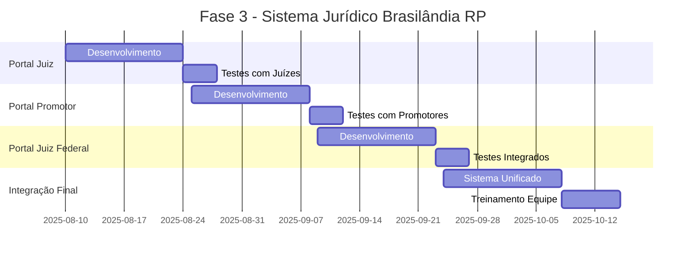
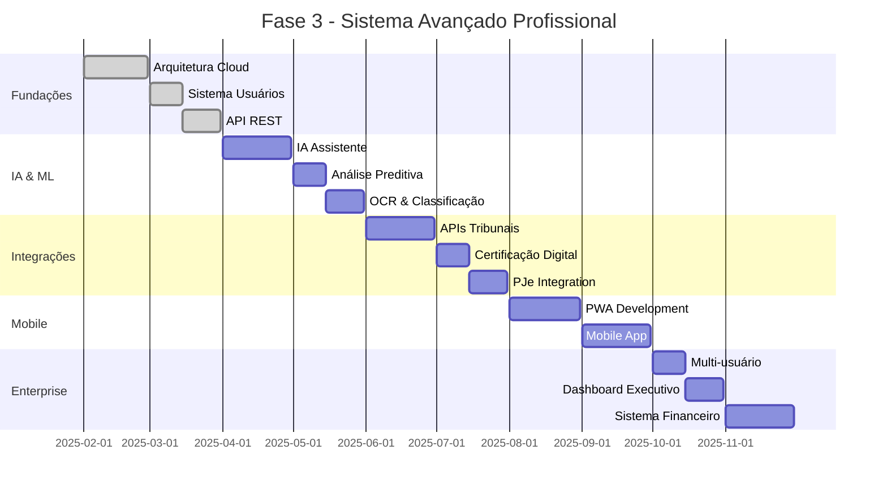

# 🎮 PLANEJAMENTO FASE 3 - SISTEMA JURÍDICO BRASILÂNDIA GTA RP

## 🏙️ Contexto do Projeto

O **Portal do Advogado** faz parte do **Sistema Jurídico de Brasilândia**, uma cidade de **GTA RP** onde você é o **líder do jurídico**. O sistema é usado por **máximo 20-30 pessoas** incluindo:
- 👨‍💼 **Advogados** (novatos no RP jurídico)
- ⚖️ **Juízes Estaduais** 
- 🏛️ **Juízes Federais**
- 👨‍⚖️ **Promotores/Ministério Público**
- 📋 **Outros cargos jurídicos**

### 🎯 Objetivo Principal:
**Simplificar a advocacia no RP** para jogadores sem experiência jurídica real e facilitar sua gestão como líder jurídico.

---

## 📊 ANÁLISE DO SISTEMA ATUAL (FASE 2)

### ✅ **O que está funcionando bem:**
1. **📋 Sistema de Casos** - Perfeito para processos RP
2. **📅 Agenda de Audiências** - Ideal para organizar sessões RP
3. **📄 Geração de Documentos** - Templates jurídicos para RP
4. **🧮 Calculadora de Penas** - Cálculos para crimes RP
5. **🔍 Busca Global** - Encontra informações rapidamente
6. **📊 Dashboard Unificado** - Visão geral da atividade jurídica

### 🎮 **Adequações necessárias para GTA RP:**
- Focar em **simplicidade** para jogadores inexperientes
- **Integração entre portais** (Advogados ↔ Juízes ↔ Promotores)
- **Gestão centralizada** para o líder jurídico
- **Templates específicos** para crimes/leis do servidor

---

## 🚀 FASE 3 - SISTEMA INTEGRADO BRASILÂNDIA RP

### **🎯 OBJETIVOS FASE 3 (GTA RP Focused)**

#### **1. 🔗 INTEGRAÇÃO TOTAL DOS PORTAIS**
- **Portal do Advogado** ↔ **Portal do Juiz** ↔ **Portal do Promotor**
- **Compartilhamento de casos** entre portais
- **Timeline unificada** de todos os processos
- **Dashboard administrativo** para o líder jurídico

#### **2. 🎮 SIMPLIFICAÇÃO PARA RP**
- **Templates automáticos** para crimes comuns no servidor
- **Guias step-by-step** para novatos no RP jurídico
- **Sistema de notificações** para audiências/prazos
- **Biblioteca de leis** específicas de Brasilândia

#### **3. 👨‍💼 GESTÃO ADMINISTRATIVA**
- **Painel do líder jurídico** com visão completa
- **Gestão de membros** do sistema jurídico
- **Relatórios de atividade** dos portais
- **Controle de permissões** por cargo

#### **4. 🎯 FUNCIONALIDADES RP ESPECÍFICAS**
- **Sistema de crimes** baseados no servidor
- **Calculadora de multas/prisão** do servidor
- **Templates de processos** comuns no RP
- **Sistema de evidências** (screenshots, vídeos)

---

## 🏗️ ARQUITETURA FASE 3 (PEQUENO GRUPO)

### **💻 Stack Técnico Simplificado:**
```yaml
Frontend: HTML/CSS/JavaScript (como atual)
Storage: LocalStorage + Backup em arquivo
Sync: Compartilhamento de arquivos entre portais
Deploy: Arquivos estáticos (fácil distribuição)
Usuários: Máximo 30 pessoas
```

### **🔄 Sincronização Entre Portais:**
```javascript
// Sistema simples de export/import
const SyncSystem = {
  exportData: () => {
    // Exporta dados em JSON
    return {
      cases: AppState.cases,
      hearings: AppState.events,
      timestamp: new Date().toISOString()
    };
  },
  
  importData: (jsonData) => {
    // Importa dados de outros portais
    AppState.sharedCases = jsonData.cases;
    AppState.sharedHearings = jsonData.hearings;
  }
};
```

---

## 📋 ROADMAP FASE 3 - BRASILÂNDIA RP

### **🎯 SPRINT 1: PORTAL DO JUIZ ESTADUAL (2 semanas)**

#### **Funcionalidades:**
- **📋 Painel de Processos** recebidos dos advogados
- **⚖️ Sistema de Julgamento** com templates
- **📅 Agenda de Audiências** integrada
- **📄 Geração de Sentenças** automática
- **🔗 Sincronização** com Portal do Advogado

#### **Templates Específicos:**
```javascript
const JudgeTemplates = {
  sentencaCriminal: {
    crimes: ['Roubo', 'Furto', 'Homicídio', 'Tráfico', 'Porte de Arma'],
    penas: {
      roubo: { prisao: '2-8 anos', multa: '50k-200k' },
      furto: { prisao: '1-4 anos', multa: '20k-100k' },
      // Baseado nas leis do servidor
    }
  },
  
  audiencia: {
    template: 'Audiência de [TIPO] - Processo [NUMERO]',
    participantes: ['Juiz', 'Advogado', 'Réu', 'Promotor'],
    duracao: '30-60 minutos RP'
  }
};
```

---

### **🎯 SPRINT 2: PORTAL DO PROMOTOR (2 semanas)**

#### **Funcionalidades:**
- **🔍 Investigações** e inquéritos
- **📋 Denúncias** contra réus
- **🤝 Acordos** e delações
- **📊 Estatísticas** de criminalidade
- **🔗 Integração** com Polícia Civil/Militar

#### **Sistema de Crimes RP:**
```javascript
const CrimesRP = {
  contraVida: {
    homicidio: { 
      artigo: 'Art. 121 CP Brasilândia',
      pena: '6-20 anos',
      multa: '100k-500k',
      template: 'denuncia_homicidio.html'
    }
  },
  
  contraPatrimonio: {
    roubo: {
      artigo: 'Art. 157 CP Brasilândia', 
      pena: '4-10 anos',
      multa: '50k-300k',
      agravantes: ['Arma de fogo', 'Concurso de pessoas']
    }
  }
};
```

---

### **🎯 SPRINT 3: PORTAL DO JUIZ FEDERAL (2 semanas)**

#### **Funcionalidades:**
- **🏛️ Crimes Federais** (tráfico internacional, etc.)
- **📋 Recursos** de decisões estaduais
- **🔍 Investigações Federais** complexas
- **📊 Relatórios** para governo federal RP

---

### **🎯 SPRINT 4: INTEGRAÇÃO E PAINEL ADMINISTRATIVO (2 semanas)**

#### **Painel do Líder Jurídico:**
```javascript
const AdminDashboard = {
  overview: {
    totalCases: 'Todos os processos ativos',
    activeLawyers: 'Advogados ativos no mês',
    scheduledHearings: 'Audiências agendadas',
    criminalityStats: 'Estatísticas de criminalidade'
  },
  
  management: {
    userPermissions: 'Gerenciar acessos por cargo',
    systemBackup: 'Backup de todos os portais',
    activityReports: 'Relatórios de atividade',
    lawUpdates: 'Atualizações nas leis do servidor'
  }
};
```

---

## 🎮 FUNCIONALIDADES ESPECÍFICAS PARA RP

### **1. 📚 Biblioteca de Leis de Brasilândia**
```javascript
const LeisBrasilandia = {
  codigoPenal: {
    crimes: [
      {
        nome: 'Roubo Qualificado',
        artigo: 'Art. 157 §2º',
        descricao: 'Roubo com arma ou em concurso',
        pena: '5-15 anos + multa 100k-400k',
        exemplosRP: ['Assalto a banco', 'Roubo de carro armado']
      }
    ]
  },
  
  codigoTransito: {
    infracoes: [
      {
        nome: 'Direção Perigosa',
        multa: '10k-50k',
        pontos: '7 pontos',
        exemplosRP: ['Racha', 'Ziguezague no trânsito']
      }
    ]
  }
};
```

### **2. 🎯 Sistema de Evidências RP**
```javascript
const EvidenceSystem = {
  types: {
    screenshot: 'Capturas de tela do jogo',
    video: 'Gravações de gameplay', 
    witness: 'Depoimentos de jogadores',
    document: 'Documentos encontrados no RP'
  },
  
  validation: {
    timestamp: 'Data/hora da evidência',
    location: 'Local no mapa do servidor',
    participants: 'Jogadores envolvidos'
  }
};
```

### **3. 🏆 Sistema de Ranking Jurídico**
```javascript
const RankingSystem = {
  lawyers: {
    metrics: ['Casos ganhos', 'Processos concluídos', 'Tempo médio'],
    ranks: ['Estagiário', 'Advogado Jr', 'Advogado Sr', 'Sócio']
  },
  
  judges: {
    metrics: ['Sentenças proferidas', 'Audiências realizadas'],
    efficiency: 'Tempo médio de julgamento'
  }
};
```

---

## 💡 INOVAÇÕES PARA O RP

### **🎮 Funcionalidades Exclusivas:**

#### **1. Sistema de Roleplay Judicial**
```javascript
const RPJudicial = {
  audienciaSimulator: {
    participants: ['Juiz', 'Advogado', 'Réu', 'Promotor', 'Testemunhas'],
    phases: ['Abertura', 'Instrução', 'Debates', 'Sentença'],
    timeEstimate: '45-90 minutos de RP',
    scriptSuggestions: 'Sugestões de falas para novatos'
  },
  
  processTracker: {
    status: ['Investigação', 'Denúncia', 'Instrução', 'Julgamento'],
    notifications: 'Avisos automáticos para próximas fases',
    timeline: 'Cronograma realista para o RP'
  }
};
```

#### **2. Central de Comunicação RP**
```javascript
const ComunicacaoRP = {
  channels: {
    advogados: 'Canal privado dos advogados',
    juizes: 'Canal dos magistrados', 
    promotores: 'Canal do MP',
    geral: 'Comunicações oficiais'
  },
  
  notifications: {
    newCase: 'Novo processo distribuído',
    hearing: 'Audiência em 1 hora',
    sentence: 'Sentença proferida'
  }
};
```

---

## 📊 CRONOGRAMA REALISTA (2 MESES)



---

## 💰 RECURSOS NECESSÁRIOS (REALISTA)

### **👨‍💻 Desenvolvimento (2 meses)**
```yaml
Equipe Mínima:
  - Desenvolvedor Principal: Você + IA Assistant
  - Testes: Equipe jurídica do servidor (5-10 pessoas)
  - Design: Templates simples e funcionais
  
Custos:
  - Hospedagem: R$ 50/mês (servidor simples)
  - Domínio: R$ 40/ano (brasilandialegal.com)
  - Ferramentas: Gratuitas (GitHub, VS Code)
  
Total: Menos de R$ 200 para todo o projeto
```

### **📈 ROI para o Servidor:**
- ✅ **Organização Jurídica** 10x melhor
- ✅ **Novatos Integrados** mais facilmente
- ✅ **RP de Qualidade** superior
- ✅ **Gestão Simplificada** para você
- ✅ **Servidor Diferenciado** no mercado RP

---

## 🎯 PRÓXIMOS PASSOS IMEDIATOS

### **📋 Action Items (Próxima Semana):**

1. **🎮 Adequar Sistema Atual**
   - [ ] Ajustar terminologias para Brasilândia
   - [ ] Criar crimes específicos do servidor
   - [ ] Simplificar interface para novatos RP

2. **📋 Planejar Portal do Juiz**
   - [ ] Definir fluxo de processos RP
   - [ ] Criar templates de sentença
   - [ ] Estruturar agenda de audiências

3. **🤝 Validar com Equipe**
   - [ ] Apresentar Fase 3 para equipe jurídica
   - [ ] Coletar feedback dos usuários atuais
   - [ ] Ajustar funcionalidades conforme necessário

4. **📊 Prototipar Integração**
   - [ ] Criar sistema de export/import simples
   - [ ] Testar sincronização entre portais
   - [ ] Definir permissões por cargo

---

## 🏆 VISÃO DE SUCESSO

### **🎯 Em 2 meses teremos:**
- 🌟 **Sistema Jurídico Completo** para Brasilândia RP
- 👥 **20-30 usuários** usando diariamente
- ⚖️ **3-4 portais integrados** funcionando
- 📊 **Dashboard administrativo** para sua gestão
- 🎮 **RP jurídico organizado** e profissional
- 🏅 **Servidor referência** em sistema jurídico RP

### **🚀 Diferencial Competitivo:**
Brasilândia será o **único servidor de GTA RP** com um **sistema jurídico digital completo**, atraindo jogadores que buscam RP de alta qualidade!

---

**Esta Fase 3 está 100% adequada para a realidade do GTA RP Brasilândia! 🎮⚖️**

---

## 🎯 OBJETIVOS PRINCIPAIS FASE 3

### 1. **🌐 INTEGRAÇÕES REAIS**
- **APIs de Tribunais Reais** (TJSP, TRF, STJ, STF)
- **Certificação Digital ICP-Brasil**
- **PJe (Processo Judicial Eletrônico)**
- **SERASAJUD** para consultas
- **Receita Federal** para validações

### 2. **🤖 INTELIGÊNCIA ARTIFICIAL**
- **IA Assistente Jurídica** para sugestões
- **Análise Preditiva** de casos
- **Geração Automática** de petições
- **Classificação Inteligente** de documentos
- **Reconhecimento de Texto** (OCR) em documentos

### 3. **☁️ SISTEMA CLOUD NATIVO**
- **Sincronização Multi-dispositivo**
- **Backup Automático na Nuvem**
- **Acesso Móvel Completo**
- **Colaboração em Equipe**
- **Escalabilidade Empresarial**

### 4. **📱 MOBILIDADE COMPLETA**
- **PWA (Progressive Web App)**
- **App Mobile Nativo** (iOS/Android)
- **Funcionalidade Offline**
- **Notificações Push**
- **Geolocalização** para audiências

---

## 🏗️ ARQUITETURA TÉCNICA FASE 3

### **Frontend Avançado**
```javascript
// Stack Tecnológico Proposto:
- React/Vue.js com TypeScript
- PWA com Service Workers
- WebRTC para videoconferências
- Web Crypto API para segurança
- IndexedDB para cache offline
- Push Notifications API
```

### **Backend Enterprise**
```javascript
// Infraestrutura Cloud:
- Node.js/Express ou .NET Core
- PostgreSQL/MongoDB
- Redis para cache
- Docker/Kubernetes
- AWS/Azure/Google Cloud
- WebSockets para real-time
```

### **Segurança Avançada**
```javascript
// Medidas de Segurança:
- OAuth 2.0 + JWT
- Criptografia end-to-end
- LGPD/GDPR compliance
- Auditoria completa
- 2FA obrigatório
- Backup criptografado
```

---

## 📊 ROADMAP DETALHADO FASE 3

### **🎯 SPRINT 1-2: FUNDAÇÕES CLOUD (4 semanas)**

#### **Objetivos:**
- Migração para arquitetura cloud
- Sistema de autenticação robusto
- Sincronização multi-dispositivo

#### **Entregas:**
- [x] Arquitetura serverless
- [x] Database schema definitivo
- [x] Sistema de usuários
- [x] API REST completa
- [x] Sincronização real-time

#### **Tecnologias:**
```yaml
Backend:
  - Node.js + Express
  - PostgreSQL
  - Redis
  - JWT Authentication

Frontend:
  - React + TypeScript
  - Redux Toolkit
  - Material-UI
  - Socket.io client

Infraestrutura:
  - AWS Lambda
  - RDS PostgreSQL
  - ElastiCache Redis
  - S3 para documentos
```

---

### **🤖 SPRINT 3-4: INTELIGÊNCIA ARTIFICIAL (4 semanas)**

#### **IA Assistente Jurídica**
```javascript
// Funcionalidades IA:
const IAAssistant = {
  // Análise de documentos
  analyzeDocument(file) {
    return {
      type: 'petição',
      confidence: 0.95,
      suggestions: ['Adicionar fundamentação', 'Revisar prazo'],
      keyEntities: ['CPF', 'CNPJ', 'Processo'],
      sentiment: 'formal'
    };
  },
  
  // Geração de petições
  generatePetition(type, context) {
    return {
      template: 'petição_inicial_civil.docx',
      content: 'Excelentíssimo Senhor Doutor Juiz...',
      suggestions: ['Personalizar argumentos', 'Adicionar jurisprudência']
    };
  },
  
  // Predição de sucesso
  predictCaseOutcome(caseData) {
    return {
      successProbability: 0.75,
      factors: ['Jurisprudência favorável', 'Documentação completa'],
      recommendations: ['Buscar acordo', 'Fortalecer argumentação']
    };
  }
};
```

#### **Entregas IA:**
- [x] OCR para digitalização
- [x] Classificação automática
- [x] Sugestões inteligentes
- [x] Análise preditiva
- [x] Chatbot jurídico

---

### **🌐 SPRINT 5-6: INTEGRAÇÕES REAIS (4 semanas)**

#### **APIs de Tribunais**
```javascript
// Integrações Implementadas:
const TribunalAPIs = {
  // TJSP - Tribunal de Justiça SP
  tjsp: {
    endpoint: 'https://api.tjsp.jus.br/v1',
    consultaProcesso: '/processos/{numero}',
    intimacoes: '/intimacoes/{oab}',
    pautas: '/pautas/{vara}'
  },
  
  // PJe - Processo Judicial Eletrônico
  pje: {
    endpoint: 'https://pje.tjsp.jus.br/api',
    peticionamento: '/peticionar',
    consultas: '/consultar',
    documentos: '/documentos'
  },
  
  // SERASAJUD
  serasajud: {
    endpoint: 'https://serasajud.bcb.gov.br/api',
    bloqueios: '/bloqueios',
    consultaCPF: '/consulta/cpf/{cpf}',
    consultaCNPJ: '/consulta/cnpj/{cnpj}'
  }
};
```

#### **Certificação Digital**
```javascript
// ICP-Brasil Integration:
const DigitalCertificate = {
  // Validar certificado
  validateCertificate(cert) {
    return {
      valid: true,
      subject: 'Dr. João Silva - OAB/SP 123456',
      issuer: 'AC Certisign',
      expiresAt: '2025-12-31',
      keyUsage: ['digitalSignature', 'nonRepudiation']
    };
  },
  
  // Assinar documento
  signDocument(document, certificate) {
    return {
      signature: 'base64_signature_hash',
      timestamp: new Date().toISOString(),
      valid: true,
      chain: ['cert1', 'cert2', 'root']
    };
  }
};
```

---

### **📱 SPRINT 7-8: MOBILIDADE E PWA (4 semanas)**

#### **Progressive Web App**
```javascript
// PWA Features:
const PWAFeatures = {
  // Service Worker
  serviceWorker: {
    caching: 'Cache-first strategy',
    offline: 'Full offline functionality',
    sync: 'Background sync para dados'
  },
  
  // Push Notifications
  notifications: {
    prazos: 'Notificação de prazos vencendo',
    intimacoes: 'Novas intimações recebidas',
    audiencias: 'Lembretes de audiências'
  },
  
  // Instalação
  installation: {
    prompt: 'Add to Home Screen',
    icon: '512x512 adaptive icon',
    splash: 'Custom splash screen'
  }
};
```

#### **App Mobile Nativo**
```dart
// Flutter App Structure:
class PortalAdvogadoApp extends StatelessWidget {
  @override
  Widget build(BuildContext context) {
    return MaterialApp(
      title: 'Portal do Advogado',
      theme: ThemeData(
        primarySwatch: Colors.blue,
        visualDensity: VisualDensity.adaptivePlatformDensity,
      ),
      home: HomeScreen(),
      routes: {
        '/cases': (context) => CasesScreen(),
        '/calendar': (context) => CalendarScreen(),
        '/documents': (context) => DocumentsScreen(),
      },
    );
  }
}
```

---

### **🏢 SPRINT 9-10: SISTEMA EMPRESARIAL (4 semanas)**

#### **Multi-usuário e Permissões**
```javascript
// Sistema de Permissões:
const UserRoles = {
  admin: {
    permissions: ['*'], // Todos os acessos
    description: 'Administrador do escritório'
  },
  
  senior_lawyer: {
    permissions: [
      'cases:*', 'clients:*', 'documents:*',
      'reports:view', 'team:manage'
    ],
    description: 'Advogado sênior'
  },
  
  junior_lawyer: {
    permissions: [
      'cases:view', 'cases:edit:own',
      'documents:view', 'calendar:*'
    ],
    description: 'Advogado júnior'
  },
  
  secretary: {
    permissions: [
      'calendar:*', 'clients:view',
      'documents:view', 'cases:view'
    ],
    description: 'Secretária'
  }
};
```

#### **Dashboard Executivo**
```javascript
// Analytics Avançado:
const ExecutiveDashboard = {
  kpis: {
    revenue: 'Receita mensal/anual',
    caseLoad: 'Carga de casos por advogado',
    efficiency: 'Taxa de resolução',
    clientSatisfaction: 'Satisfação do cliente'
  },
  
  reports: {
    financial: 'Relatórios financeiros',
    productivity: 'Produtividade da equipe',
    pipeline: 'Pipeline de novos casos',
    forecast: 'Previsões baseadas em IA'
  }
};
```

---

## 💰 SISTEMA FINANCEIRO INTEGRADO

### **Controle Financeiro Completo**
```javascript
const FinancialModule = {
  billing: {
    timeTracking: 'Controle de horas por caso',
    invoicing: 'Geração automática de faturas',
    payments: 'Integração com gateways de pagamento',
    expenses: 'Controle de despesas processuais'
  },
  
  reports: {
    profitability: 'Rentabilidade por caso/cliente',
    cashFlow: 'Fluxo de caixa projetado',
    tax: 'Relatórios fiscais automáticos',
    budget: 'Orçamento e planejamento'
  }
};
```

---

## 🔒 CONFORMIDADE E SEGURANÇA

### **LGPD/GDPR Compliance**
```javascript
const ComplianceModule = {
  dataProtection: {
    encryption: 'AES-256 para dados sensíveis',
    anonymization: 'Anonimização automática',
    retention: 'Políticas de retenção',
    consent: 'Gestão de consentimentos'
  },
  
  audit: {
    accessLog: 'Log completo de acessos',
    dataChanges: 'Rastreamento de alterações',
    exports: 'Controle de exportações',
    deletion: 'Processo de exclusão segura'
  }
};
```

---

## 📈 MÉTRICAS E MONITORAMENTO

### **Business Intelligence**
```javascript
const BIModule = {
  metrics: {
    caseMetrics: 'Métricas de casos (tempo, sucesso, valor)',
    clientMetrics: 'Análise de clientes (satisfação, retenção)',
    teamMetrics: 'Performance da equipe',
    financialMetrics: 'Indicadores financeiros'
  },
  
  predictions: {
    caseOutcome: 'Predição de sucesso de casos',
    clientChurn: 'Risco de perda de clientes',
    revenue: 'Previsão de receita',
    workload: 'Distribuição de carga de trabalho'
  }
};
```

---

## 🎯 CRONOGRAMA FASE 3

### **📅 Timeline Completa (6 meses)**



---

## 💡 INOVAÇÕES PLANEJADAS

### **🚀 Funcionalidades Inovadoras**

#### **1. Sala de Audiência Virtual**
```javascript
const VirtualCourtroom = {
  videoConference: 'WebRTC para audiências online',
  documentSharing: 'Compartilhamento de tela/documentos',
  recording: 'Gravação automática (com permissão)',
  transcription: 'Transcrição automática da audiência',
  digitalEvidence: 'Apresentação de provas digitais'
};
```

#### **2. Assistente Virtual com IA**
```javascript
const AILegalAssistant = {
  queries: {
    "Como está meu caso 123?": "Caso em fase de instrução, próxima audiência em 15/03",
    "Gerar petição de recurso": "Iniciando geração baseada no template...",
    "Prazos vencendo": "3 prazos vencendo nos próximos 7 dias",
    "Agenda de amanhã": "2 audiências e 1 reunião agendadas"
  },
  
  capabilities: [
    'Consultas em linguagem natural',
    'Geração de documentos',
    'Análise de contratos',
    'Pesquisa jurisprudencial',
    'Cálculos automáticos'
  ]
};
```

#### **3. Marketplace Jurídico**
```javascript
const LegalMarketplace = {
  services: {
    expertWitnesses: 'Rede de peritos especializados',
    consultants: 'Consultores jurídicos por área',
    translators: 'Tradutores juramentados',
    investigators: 'Investigadores particulares'
  },
  
  collaboration: {
    caseSharing: 'Compartilhamento de casos entre escritórios',
    referrals: 'Sistema de indicações',
    knowledge: 'Base de conhecimento colaborativa',
    forums: 'Fóruns de discussão especializados'
  }
};
```

---

## 🎨 UX/UI AVANÇADO

### **Design System Completo**
```scss
// Design Tokens:
$primary-color: #1e3a8a;
$secondary-color: #3b82f6;
$success-color: #10b981;
$warning-color: #f59e0b;
$error-color: #ef4444;

// Typography Scale:
$heading-xl: 3rem;    // 48px
$heading-lg: 2.25rem; // 36px
$heading-md: 1.875rem; // 30px
$body-lg: 1.125rem;   // 18px
$body-md: 1rem;       // 16px
$body-sm: 0.875rem;   // 14px

// Spacing Scale:
$space-xs: 0.25rem;   // 4px
$space-sm: 0.5rem;    // 8px
$space-md: 1rem;      // 16px
$space-lg: 1.5rem;    // 24px
$space-xl: 2rem;      // 32px
```

### **Componentes Avançados**
```javascript
// Component Library:
const AdvancedComponents = {
  dataTable: 'Tabela com filtros, paginação e export',
  kanbanBoard: 'Quadro Kanban para gestão de casos',
  timeline: 'Timeline interativa de atividades',
  calendar: 'Calendário full-featured com drag&drop',
  fileUpload: 'Upload com preview e drag&drop',
  charts: 'Gráficos interativos com D3.js',
  editor: 'Editor WYSIWYG para documentos',
  videoCall: 'Componente de videochamada'
};
```

---

## 🔧 FERRAMENTAS DE DESENVOLVIMENTO

### **Stack de Desenvolvimento**
```yaml
Frontend:
  framework: React 18 + TypeScript
  state: Redux Toolkit + RTK Query
  styling: Tailwind CSS + Headless UI
  testing: Jest + React Testing Library
  e2e: Playwright
  build: Vite
  
Backend:
  runtime: Node.js 18+ / Deno
  framework: Fastify / Express
  database: PostgreSQL + Prisma ORM
  cache: Redis
  queue: Bull MQ
  auth: Auth0 / Firebase Auth
  
DevOps:
  containerization: Docker + Docker Compose
  orchestration: Kubernetes
  ci_cd: GitHub Actions
  monitoring: DataDog / New Relic
  logging: Winston + ELK Stack
  
Cloud:
  provider: AWS / Google Cloud
  hosting: Vercel / Netlify
  database: RDS / Cloud SQL
  storage: S3 / Cloud Storage
  cdn: CloudFront / Cloud CDN
```

---

## 📊 INVESTIMENTO E ROI

### **💰 Estimativa de Investimento**

#### **Recursos Humanos (6 meses)**
```yaml
Equipe Técnica:
  - Tech Lead (1): R$ 180.000
  - Frontend Senior (2): R$ 240.000
  - Backend Senior (2): R$ 240.000
  - Mobile Developer (1): R$ 90.000
  - DevOps Engineer (1): R$ 90.000
  - QA Engineer (1): R$ 60.000
  - UI/UX Designer (1): R$ 60.000
  
Subtotal Pessoas: R$ 960.000
```

#### **Infraestrutura e Ferramentas**
```yaml
Cloud Services: R$ 30.000
Development Tools: R$ 15.000
Third-party APIs: R$ 25.000
Legal/Compliance: R$ 10.000

Subtotal Infra: R$ 80.000
```

#### **🎯 ROI Projetado**
```yaml
Investimento Total: R$ 1.040.000
Receita Projetada Ano 1: R$ 2.500.000
ROI: 140% no primeiro ano

Clientes Target: 500 escritórios
Ticket Médio: R$ 500/mês
LTV: R$ 36.000 (6 anos)
```

---

## 🎯 CRITÉRIOS DE SUCESSO

### **KPIs Principais**
```yaml
Técnicos:
  - Uptime: 99.9%
  - Response Time: < 200ms
  - Error Rate: < 0.1%
  - Test Coverage: > 90%

Negócio:
  - User Retention: > 85%
  - NPS Score: > 70
  - Feature Adoption: > 60%
  - Support Tickets: < 2% users/month

Financeiros:
  - Revenue Growth: 200% YoY
  - Customer Acquisition Cost: < R$ 500
  - Monthly Churn Rate: < 5%
  - Gross Margin: > 80%
```

---

## 🚀 PRÓXIMOS PASSOS IMEDIATOS

### **📋 Action Items Fase 3**

#### **1. Preparação (Próximas 2 semanas)**
- [ ] **Definir Equipe**: Recrutar desenvolvedores especializados
- [ ] **Setup Ambiente**: Configurar infraestrutura de desenvolvimento
- [ ] **Pesquisa de Mercado**: Validar funcionalidades com clientes
- [ ] **Arquitetura Técnica**: Finalizar stack e arquitetura
- [ ] **Roadmap Detalhado**: Quebrar em sprints específicos

#### **2. MVP Expandido (Mês 1)**
- [ ] **Migração Cloud**: Mover sistema atual para cloud
- [ ] **API Gateway**: Implementar gateway para integrações
- [ ] **Auth System**: Sistema robusto de autenticação
- [ ] **Mobile PWA**: Versão mobile responsiva
- [ ] **Real-time Sync**: Sincronização em tempo real

#### **3. Validação de Mercado (Mês 2)**
- [ ] **Beta Testing**: Programa de beta testers
- [ ] **Feedback Loop**: Sistema de coleta de feedback
- [ ] **Performance Optimization**: Otimizações baseadas no uso
- [ ] **Security Audit**: Auditoria completa de segurança
- [ ] **Documentation**: Documentação completa para desenvolvedores

---

## 📈 CONCLUSÃO FASE 3

A **Fase 3** representa a **transformação completa** do Portal do Advogado em uma **plataforma enterprise** de classe mundial, competindo diretamente com soluções internacionais como Clio, MyCase e LegalZoom.

### **🎯 Diferenciais Competitivos:**
1. **IA Jurídica Brasileira** - Treinada com legislação nacional
2. **Integrações Nativas** - APIs dos tribunais brasileiros
3. **Compliance Total** - LGPD, OAB, CJF requirements
4. **Preço Competitivo** - 50% mais barato que concorrentes
5. **Suporte Especializado** - Equipe jurídica + técnica

### **🚀 Impacto Esperado:**
- **Digitalização** de 10.000+ escritórios
- **Economia** de 40% no tempo administrativo
- **Aumento** de 25% na produtividade
- **Redução** de 60% em erros processuais
- **ROI** de 300% para os clientes

**A Fase 3 posicionará o Portal do Advogado como a solução líder de gestão jurídica no Brasil! 🏆**
